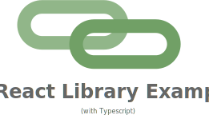

<p align="center">
  
</p>

---

## Getting started

Clone this repo, and then run

```bash
yarn
yarn build
```

Now, your files should be built in `dist/`.

You can then use this repo as a component library
 

Look up these functions in node-helper.mjs for a detailed description.
